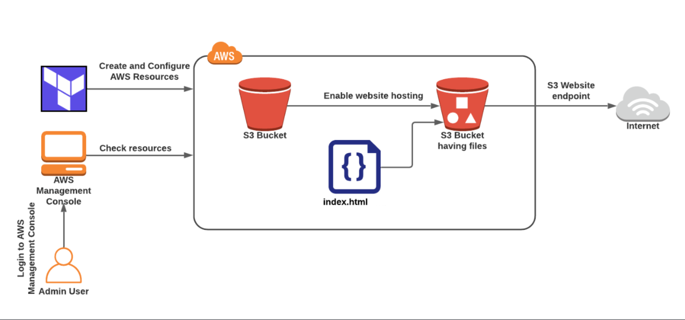
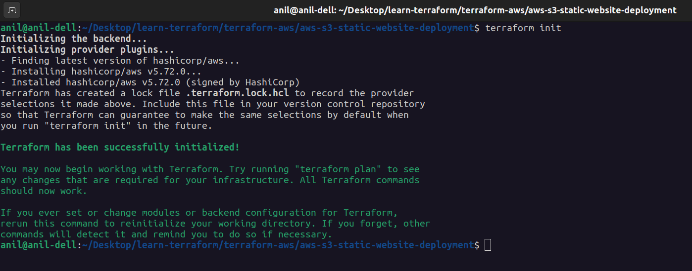
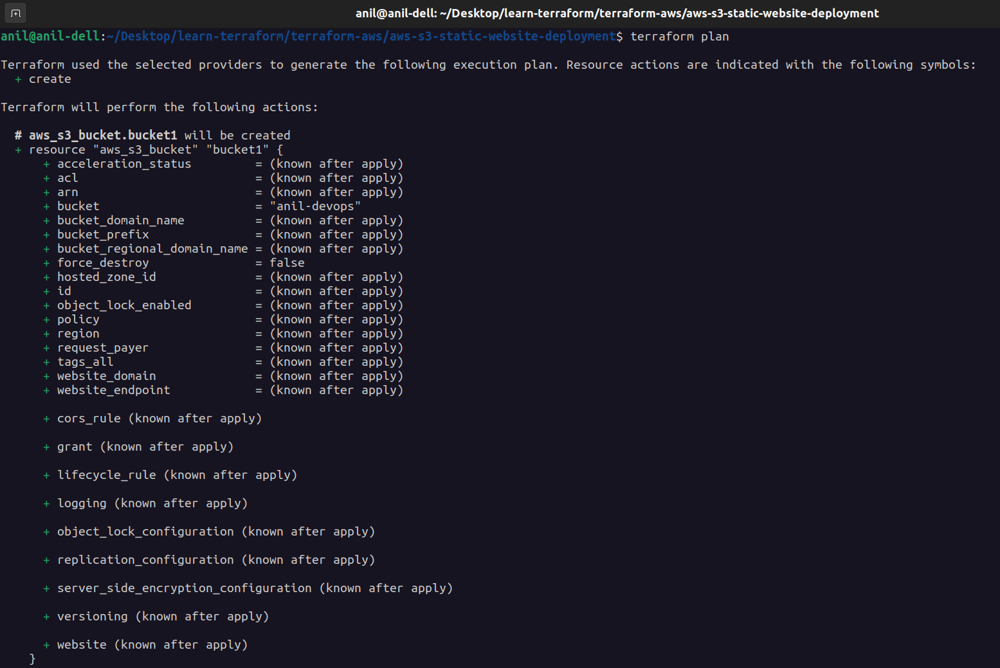
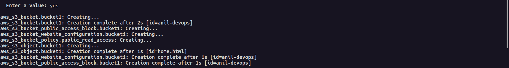
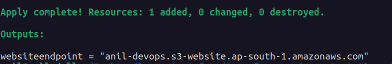
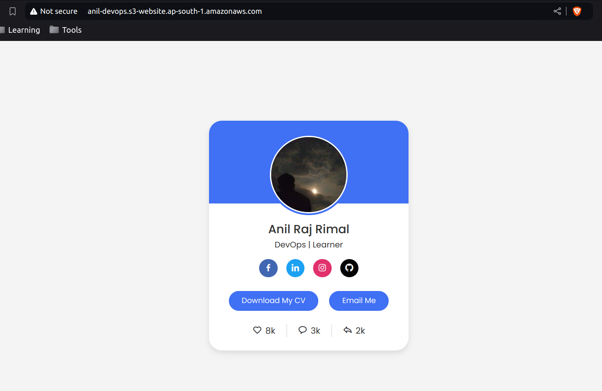

# AWS S3 Static Website Deployment using Terraform



This project demonstrates how to deploy a static website on AWS S3 using Terraform. We will be setting up an S3 bucket to host static content, configuring the bucket for public access, uploading a simple HTML file, and outputting the website URL for easy access.

## Project Overview

The following steps are automated through Terraform:
- Creation of an S3 bucket to store static website files.
- Public access configuration to make the website accessible to anyone via the internet.
- Uploading the `home.html` file into the bucket to serve as the main page.
- Configuring the S3 bucket for static website hosting with `home.html` as the index document.
- Defining a bucket policy to allow public read access to all objects within the bucket.
- Outputting the static website's URL for quick access.

This project makes use of Terraform to define and manage the entire infrastructure for the static website, ensuring it is repeatable and version-controlled.

## Resources Created

- **aws_s3_bucket**: 
  - An S3 bucket named `anil-devops`, which serves as the storage for static website files.
  - This bucket is used to host static content like HTML, CSS, and images.

- **aws_s3_bucket_public_access_block**: 
  - Configures the public access policies for the S3 bucket. 
  - We disable public ACL and policy blocking to allow public access to the website.

- **aws_s3_object**: 
  - Uploads the `home.html` file to the bucket as the static content of the website.
  - The file is identified by the key `home.html` and its content type is set to `text/html`.

- **aws_s3_bucket_website_configuration**: 
  - Configures the bucket to enable static website hosting, with `home.html` as the index document.
  - This resource is essential for serving the content as a website rather than just storing it.

- **aws_s3_bucket_policy**: 
  - A policy that grants public read access to all objects in the S3 bucket, ensuring that the website can be viewed by anyone with the link.

## How to Use

### Prerequisites

- **AWS Credentials**: Ensure that your AWS credentials are properly configured. The project uses the `anil-devops` profile, which you can adjust in the provider block if needed:
  ```hcl
  provider "aws" {
    profile = "anil-devops"
    region  = "ap-south-1"
  }
    ```
## Steps to Deploy

1. **Install Terraform**: Ensure you have Terraform installed.

2. **Initialize Terraform**: Inside the project directory, initialize Terraform. This will download the required providers and set up the environment:

```bash
terraform init
```


3. **Plan and Apply**: You can view the changes Terraform will make before applying by running the plan command:

```bash
terraform plan
```


To apply the changes and deploy the infrastructure, run:

```bash
terraform apply
```
Confirm with `yes` when prompted.



4. **Access the Website**: After applying, Terraform will output the `website_endpoint` for your S3 static website.  Visit the provided URL in your browser to access the deployed website.



## Example Structure
The following is the structure of the main Terraform resources:

```hcl
resource "aws_s3_bucket" "bucket1" {
  bucket = "anil-devops"
}

resource "aws_s3_bucket_public_access_block" "bucket1" {
  bucket                  = aws_s3_bucket.bucket1.id
  block_public_acls       = false
  block_public_policy     = false
  ignore_public_acls      = false
  restrict_public_buckets = false
}

resource "aws_s3_object" "bucket1" {
  bucket       = "anil-devops"
  key          = "home.html"
  source       = "home.html"
  content_type = "text/html"
  depends_on   = [aws_s3_bucket.bucket1]
}

resource "aws_s3_bucket_website_configuration" "bucket1" {
  bucket = aws_s3_bucket.bucket1.id
  index_document {
    suffix = "home.html"
  }
}

resource "aws_s3_bucket_policy" "public_read_access" {
  bucket = aws_s3_bucket.bucket1.id
  policy = <<EOF
{
  "Version": "2012-10-17",
  "Statement": [
    {
      "Effect": "Allow",
	  "Principal": "*",
      "Action": [ "s3:GetObject" ],
      "Resource": [
        "${aws_s3_bucket.bucket1.arn}",
        "${aws_s3_bucket.bucket1.arn}/*"
      ]
    }
  ]
}
EOF
}
```
## File Upload
The `home.html` file should contain your website's content. In this example, it's a simple HTML file that acts as the homepage of your static site.

## Outputs
Once the infrastructure is deployed, Terraform will output the URL where the static website is hosted:
```hcl
output "websiteendpoint" {
  value = aws_s3_bucket_website_configuration.bucket1.website_endpoint
}
```
You can access the website by visiting the URL displayed in the output after running `terraform apply`.



## Thank You!

Thank you for checking out this project! 😊 I hope it helps you on your Terraform learning journey. Feel free to contribute or share feedback to make it even better! Happy coding and good luck with your Terraform adventures! 🚀